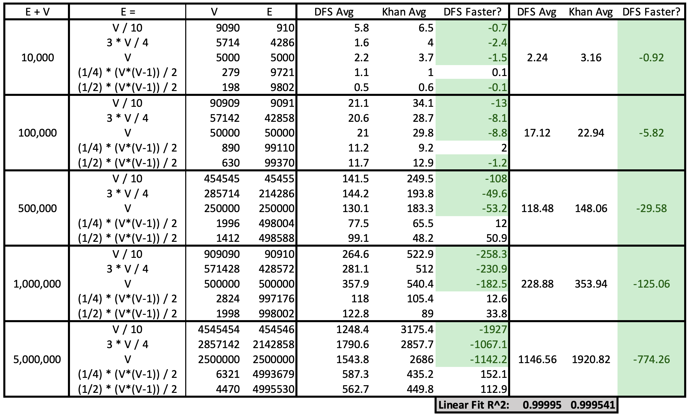

# Topological Sort
For Purdue data structures and algorithms course. Two topological sort implementations. One using DFS finishing times and the other using Khan's algorithm.

### Final Report Table

**Note** All times are in milliseconds. Averages are calculated over 10 runs with each run having a new set of vertices/edges for the given |V| to |E| relationship.